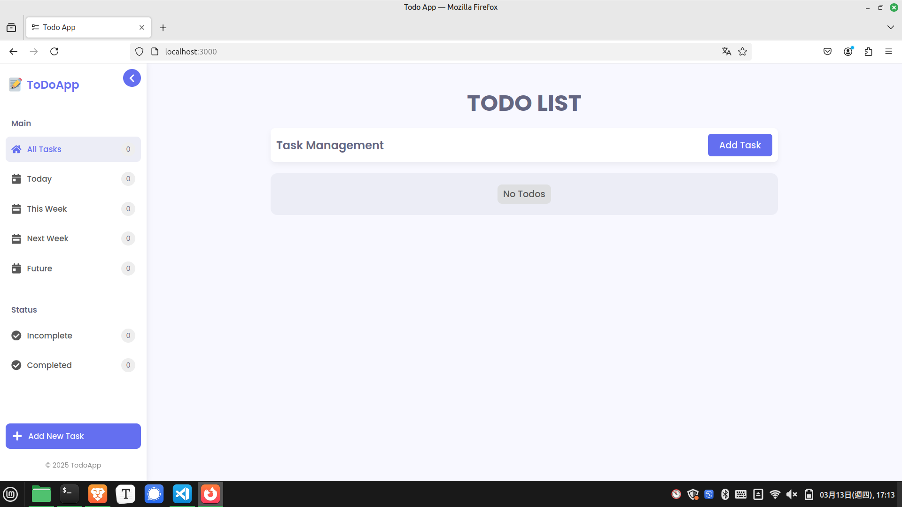

# React Todo App.

A complete todo application with all features.

\*\*live demo: not availible currently

---

## Project Description

In the project, we will be creating a Complete Todo Application with all features. We will do all the CRUD operations. We will use `React.js` and to manage our states, we will use `Redux`. Also we will learn to make simple animations using `Framer Motion`. The app includes Firebase integration for data persistence and an AI-powered chat assistant for creating tasks through natural language conversations. This will be a complete `beginner` friendly app. Hope you enjoy it.

## What we are going to learn/use

- [React](https://reactjs.org/)
- [React Redux](https://redux.js.org/)
- [Framer Motion](https://framer.com/motion/)
- [React icons](https://react-icons.netlify.com/)
- [React Hot Toast](https://react-hot-toast.com/)
- [OpenAI API](https://openai.com/)
- [Firebase](https://firebase.google.com/)
- More...

## Requirements

- Basic ReactJs knowledge
- Basic HTML, CSS knowledge

## Starter files

You can find all the starter files in `starter-files` branch. You can go to the `starter-files` branch and `download zip` the starter files or You can clone the project and git checkout to `starter-files` branch.

## Getting Started

The recommended way to get started with the project is to follow the [YouTube tutorial](https://youtu.be/W0Uf_xu350k). You will find all the step-by-step guides. Or you can start the project on your own by following the guide below.

After getting the starter files, you need to go the file directory and run

```shell
npm install
```

Set up your OpenAI API key in a `.env` file:

```
REACT_APP_OPENAI_API_KEY=your_openai_api_key_here
```

Set up your Firebase project and add the configuration to `src/firebase/config.js`.

Then start the dev server:

```shell
npm start
```

## Tools Used

1. Favicon: [Flaticon.com](https://www.flaticon.com/)
1. Code Editor: [VS Code](https://code.visualstudio.com/)

## Other projects

📚 [All Web Cifar Project Tutorials](https://github.com/ShaifArfan/wc-project-tutorials)

---

## AI Assistant Features

This application includes an AI-powered chat assistant that can help you manage your tasks through natural language. The assistant uses OpenAI's GPT models to understand your requests and can create tasks directly from your conversations.

### Available AI Functions

1. **Task Creation** - Create new tasks by simply chatting with the AI
   - Example: "Create a task to finish the report by next Friday"
   - The AI will extract the title, due date, and optional hashtags

2. **Task Search** - Find your tasks using natural language
   - Example: "Find all my tasks related to work"
   - The AI will search through your tasks and return matching results

3. **Weather Information** - Get current weather information
   - Example: "What's the weather like in New York?"
   - Useful for planning weather-dependent tasks

### How It Works

The AI assistant uses a function calling approach:

1. Your messages are sent to OpenAI's API
2. The AI identifies your intent (create task, search, etc.)
3. It extracts relevant parameters (task title, due date, etc.)
4. The application executes the corresponding function
5. For task creation, the new task is automatically added to Firebase
6. You'll see a confirmation message and the task will appear in your list

### Technical Implementation

The AI integration follows a clean separation of concerns:
- `openaiService.js` - Handles communication with OpenAI API
- `chatTaskService.js` - Converts AI responses into task objects
- `Chatbot.js` - Provides the user interface for the chat
- Integration with Redux and Firebase for task persistence

## FAQ

### Q: How can I get started?

You can get started by following the [YouTube tutorial](https://youtu.be/W0Uf_xu350k) of this project. Here is the full tutorial video link: [coming soon].

### Q: What do I need to start the project?

Just open your favorite code editor and follow along with the [YouTube tutorial](https://youtu.be/W0Uf_xu350k).

### Q: What are the prerequisites?

Basics of HTML, CSS, JavaScript and some basic knowledge of React is enough to start this project. Rest you will learn in the tutorial.

### Q: Who is the project for?

The project is for people who want to get more skilled in `ReactJs` and learn how to integrate AI features into web applications.

---

## Feedback

If you have any feedback, please reach out to us at [@web_cifar](http://instagram.com/web_cifar)

## Support

For support, join our [Community Group](http://facebook.com/groups/webcifar).

## License

[MIT](https://choosealicense.com/licenses/mit/)

Happy Coding! 🚀
